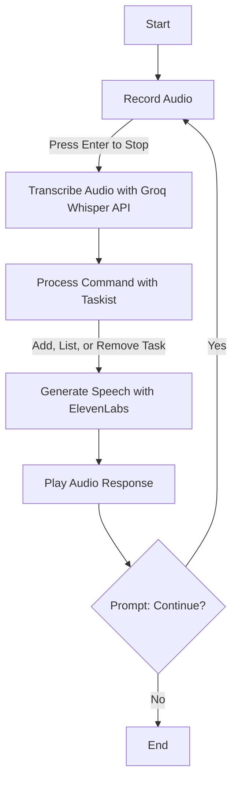

# Taskist

Taskist is a voice-activated todo list application that enables users to manage tasks using spoken commands. It records audio, transcribes it using Groq's Whisper API, processes commands to add, list, or remove tasks, and responds with spoken output via ElevenLabs. Taskist uses LangGraph to orchestrate the workflow without relying on any LLM calls.

## Demo Video

https://github.com/user-attachments/assets/1bbd3e28-8f77-4405-a51e-0582f4defb51


## Flowchart
Taskist's workflow:



## Features
- **Voice Input**: Record audio commands using a microphone, with recording stopped by pressing Enter.
- **Task Management**: Supports adding tasks (e.g., "add buy groceries"), listing tasks, and removing tasks.
- **Voice Output**: Provides spoken responses using ElevenLabs' text-to-speech API.
- **No LLM Usage**: Taskist uses simple command parsing instead of a LLM, ensuring a lightweight and deterministic experience.
- **In-Memory Storage**: Stores todo lists in memory, organized by user ID and category.
- **Interactive Loop**: Allows multiple commands in a single session with a "Continue? (y/n)" prompt.

## Learnings About Integrating STT, TTS, and LangGraph
Integrating speech-to-text (STT) and text-to-speech (TTS) with LangGraph for Taskist presented several challenges and learnings:

- **STT Integration with Groq's Whisper API**:
  - **Learning**: Capturing audio in real-time requires careful stream management. Using `sounddevice` with separate threads for recording and stopping via Enter key press ensures non-blocking operation.
  - **Error**: An error occurred where `transcription.text` was used, but `response_format="text"` returned a string, causing `'str' object has no attribute 'text'`.
  - **Solution**: Modified the code to use the `transcription` string directly when `response_format="text"`, aligning with the API's output.

- **TTS Integration with ElevenLabs**:
  - **Learning**: Configuring ElevenLabs' voice settings (e.g., stability, similarity boost) is crucial for natural-sounding output. The `mp3_22050_32` format balances quality and performance.

- **LangGraph Integration**:
  - **Learning**: LangGraph's `StateGraph` effectively orchestrates Taskist's multi-step workflow (audio input → processing → audio output). It requires a dictionary-based config with a `configurable` key.
  - **Error**: An `AttributeError: 'Configuration' object has no attribute 'items'` occurred when a `Configuration` dataclass was passed to `graph.invoke` instead of a dictionary.
  - **Solution**: Used a raw dictionary (`{"configurable": {...}}`) for `graph.invoke`, ensuring compatibility with LangGraph.

- **General Challenges**:
  - **Audio Handling**: Clean audio input and appropriate buffer sizes (`1024` samples) were critical for reliable transcription.
  - **Threading**: Separate threads for recording and stopping prevented blocking, but required careful synchronization.
  - **Environment Setup**: Correctly setting API keys and dependencies (e.g., `portaudio` for `sounddevice`) was essential for Taskist to function smoothly.

## Tech Stack
- **LangGraph**: Orchestrates Taskist's workflow (audio input, task processing, audio output).
- **Groq (Whisper API)**: Handles speech-to-text transcription.
- **ElevenLabs**: Provides text-to-speech for spoken responses.

## How to Use
1. **Install Dependencies**:
   - Ensure Python 3.9+ is installed.
   - Install required packages:
     ```bash
     pip install -r requirements.txt
     ```
   - Install `portaudio` for `sounddevice` (e.g., `pip install portaudio` on Linux).

2. **Set Up API Keys**:
   - Obtain a Groq API key from [Groq's API service](https://console.groq.com/keys).
   - Obtain an ElevenLabs API key from [ElevenLabs](https://elevenlabs.io/).
   - Set environment variables in a `.env` file:
     ```bash
     GROQ_API_KEY='your-groq-api-key'
     ELEVENLABS_API_KEY='your-elevenlabs-api-key'
     ```

3. **Save and Run the Script**:
   - Save the script as `app.py`.
   - Run the script:
     ```bash
     python app.py
     ```

4. **Interact with Taskist**:
   - When prompted, speak a command (e.g., "add buy groceries", "list", "remove buy groceries") and press Enter to stop recording.
   - Taskist will transcribe the audio, process the command, and play a spoken response.
   - After each command, enter `y` to continue or `n` to exit at the "Continue? (y/n)" prompt.

5. **Example Commands**:
   - "add buy groceries" → Adds "buy groceries" to the todo list.
   - "list" → Lists all tasks in the current category.
   - "remove buy groceries" → Removes "buy groceries" from the list.

6. **Notes**:
   - Taskist's todo list is stored in memory and resets when the script exits.
   - Ensure a working microphone and audio output device are connected.
   - If transcription fails, speak clearly and ensure a quiet environment.
